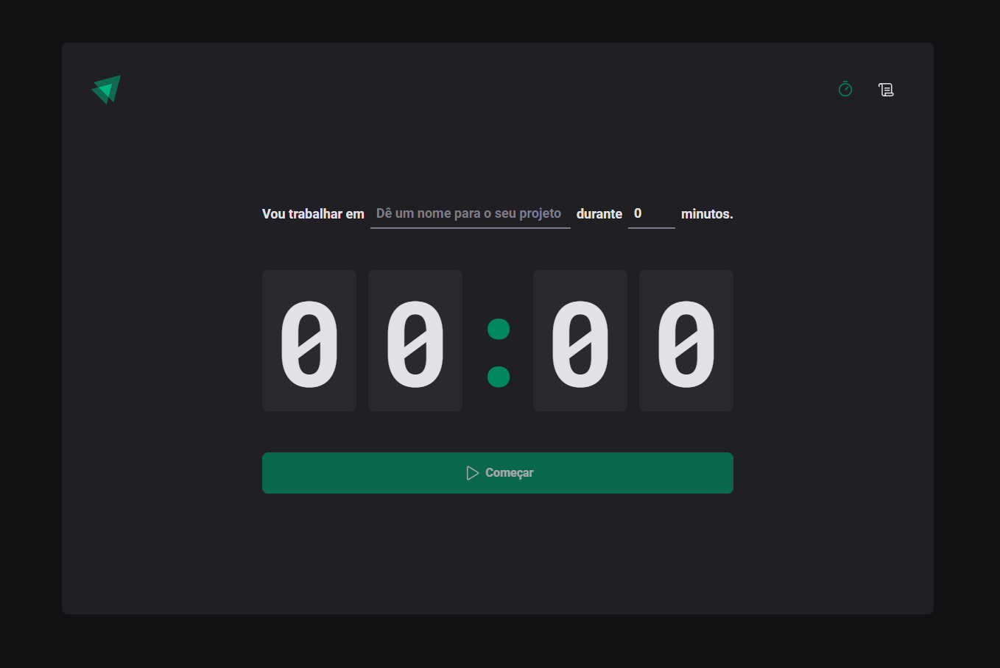

<h4 align="center">

</h4>

<h4 align="center">
    <p align="center">
      <a href="#-about">About</a>&nbsp;&nbsp;&nbsp;|&nbsp;&nbsp;&nbsp;
      <a href="#-technologies">Technologies</a>&nbsp;&nbsp;&nbsp;|&nbsp;&nbsp;&nbsp;
      <a href="#-how-to-run-the-project">Run</a>&nbsp;&nbsp;&nbsp;|&nbsp;&nbsp;&nbsp;
      <a href="#-info">Info</a>&nbsp;&nbsp;&nbsp;|&nbsp;&nbsp;&nbsp;
      <a href="#-license">License</a>
  </p>
</h4>

<h1 align="center">
  
</h1>

## 🔖 About

O **Ignite Timer** é um projeto baseado na técnica pomodoro, que permite ao usuário controlar o tempo de trabalho e descanso.

Com esse projeto é possível:

- Começar um timer para o trabalho;
- Interromper o timer;
- Listar os timers em listagem;

O layout está disponível no [Figma](https://www.figma.com/community/file/1127351821076435124)

## 🚀 Technologies

- [ReactJS](https://reactjs.org/)
- [TypeScript](https://www.typescriptlang.org/)
- [Vitejs](https://vitejs.dev/)
- [PhosphorIcons](https://phosphoricons.com/)
- [date-fns](https://date-fns.org/)
- [Immer](https://immerjs.github.io/immer/)
- [Styled Components](https://styled-components.com/)
- [Zod](https://zod.dev/)
- [React Hook Form](https://react-hook-form.com/)

## 🏁 How to run the project

```bash
# Clone the repository
git clone https://github.com/rafinhaa/ignite-timer.git
cd ignite-timer

# Install the dependencies
npm install

# Start the application
npm run dev
```

## ℹ️ Info

## 📝 License

[MIT](LICENSE)

**Free Software, Hell Yeah!**
